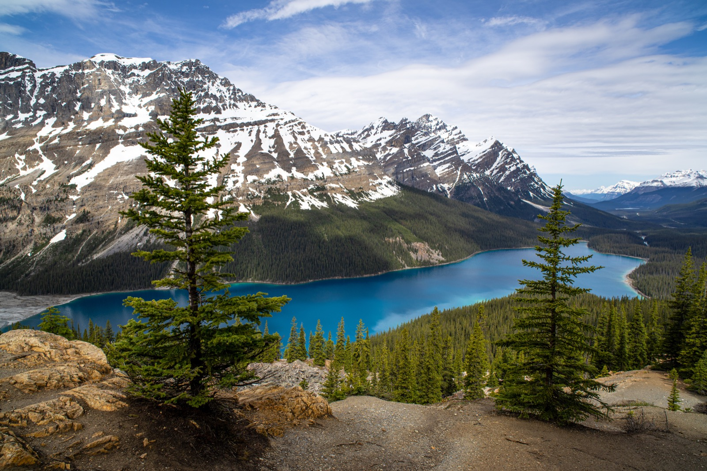

## Hi I'm Florian

  
### About Me
##### :mortar_board: I'm currently working as a PhD student at the University of Passau in Germany. 
:key: My research interests are in the domain of IT-Security and Hardware security. Currently I'm focusing on the development  of hardware trust anchors within different types of memories. 
But I'm also interested in other domains of computer science and open source projects. My favorite programming language is C++.

 

### Contact Me

  

### Other Hobbies and Activities

:bicyclist: During the summer month I like to go mountain biking in the vicinity of Passau.  
 :mount_fuji: I also like to go hiking in the mountains. 
 :ski: and skiing during the winter. 
 :boat: :camera: Traveling  and combining my trips with landscape photography is also one of my favorite hobbies. 
 :airplane: I'm currently working on my private pilot licencse and I'm member of the fire department of my home town. 
 
 
